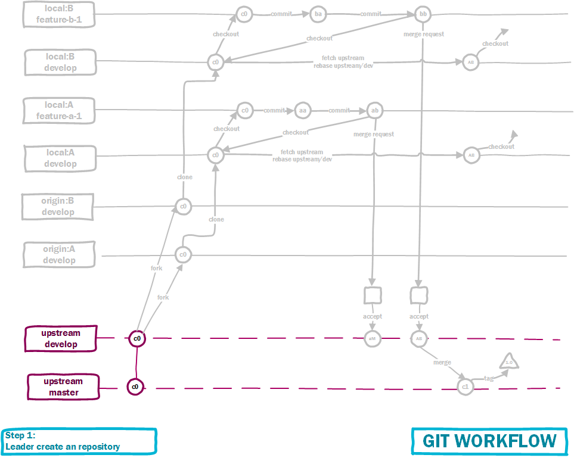

## Team Workflow

In this article, I will represent our workflow with git to collaboration. As you can see, there are `upstream`, `A`, `B` repositories. Upstream repostiroy is main repository of project, owner by team leader. `A` and `B` repositories belong to developers. In `upstream` remote, there are `master` and `dev` branches. In developer's repositories, there are `dev` and `feature-something` branches.

### Step 1: Create new project

In step 1, leader create a repository.

### Step 2: Forking

In step 2, each developers create their own repository by forking main repository

### Step 3: Commits

In step 3, developers work on their brands, each peace of their works should be end be a `commit`

### Step 4: Merge Requests

After finish a feature, each developer will create a `merge requests` to main repository. Leader take repository for merging their requests

### Step 5: fetch and rebase

Developer will checkout to dev `branch`, fetch from upstream remote and rebase

### Step 6: Develop new features

**Team sync**. So developer can `checkout` from dev feature to create new feature.

### Step 7: New version

Leader take repository to merge from dev branch to master branch and create tag to release new version.

