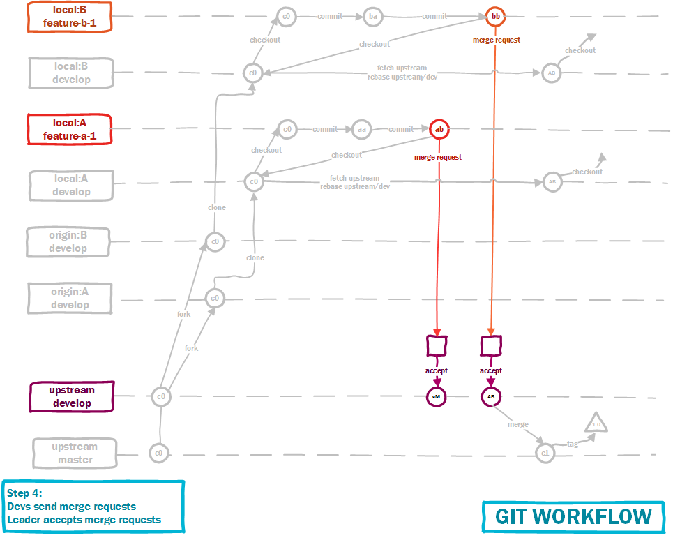
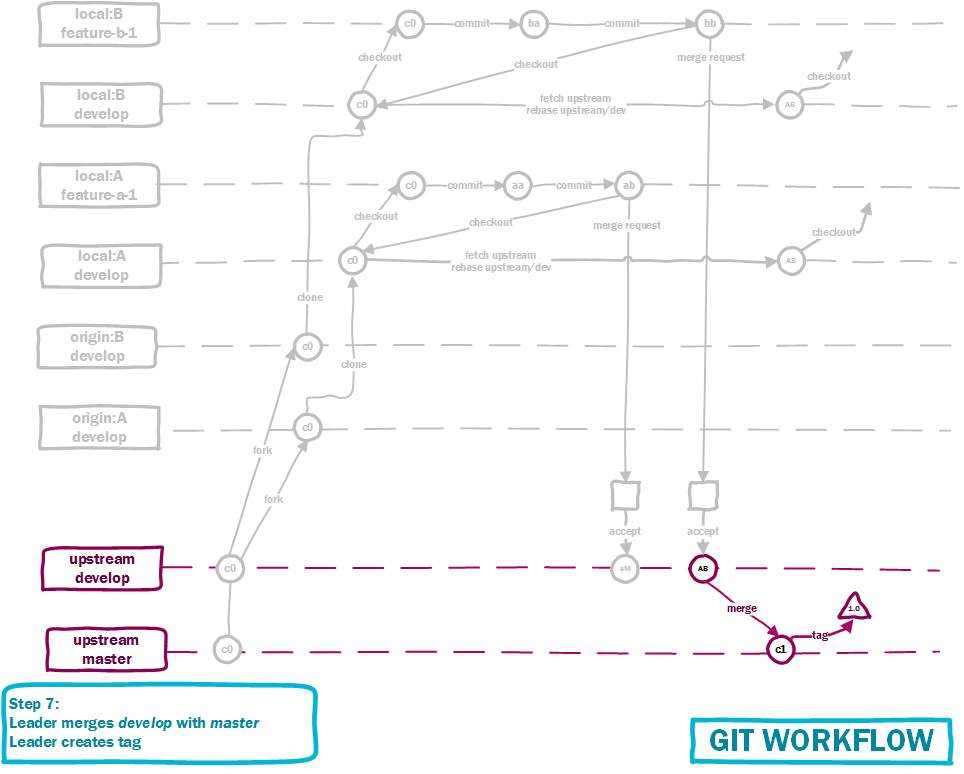

## Team Workflow

In this article, I will represent our workflow with git to collaboration. As you can see, there are `upstream`, `A`, `B` repositories. Upstream repostiroy is main repository of project, owner by team leader. `A` and `B` repositories belong to developers. In `upstream` remote, there are `master` and `develop` branches. In developer's repositories, there are `develop` and `feature-something` branches.

### Step 1: Create new project

In step 1, leader create a repository.

### Step 2: Forking

In step 2, each developers create their own repository by forking main repository

### Step 3: Commits

In step 3, developers work on their branches, each peace of their works should be end by a `commit`

### Step 4: Merge Requests

After finish a feature, each developer will create a `merge requests` to main repository. Leader take responsibility for merging their requests

### Step 5: Fetch and Rebase

Developer will checkout to `develop` branch, fetch from upstream remote and rebase

### Step 6: Develop new features

**Team sync**. At this moment, developer can `checkout` from `develop` branch to create new feature.

### Step 7: New version

Leader take responsibility to merge from dev branch to master branch and create tag to release new version.

## Related Readings

* ["Git With Development, Staging And Production Branches". *stackoverflow.com*. N.p., 2016. Web. 28 Oct. 2016.](http://stackoverflow.com/questions/15072243/git-with-development-staging-and-production-branches)
* ["A Successful Git Branching Model". *nvie.com*. N.p., 2016. Web. 28 Oct. 2016.](http://nvie.com/posts/a-successful-git-branching-model/)
